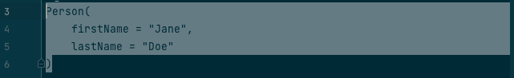
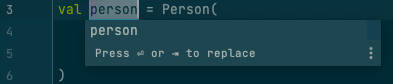
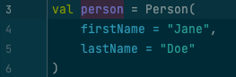
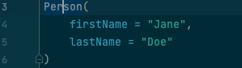

# IntelliJ Cheat Sheet

# Table of Contents
1. [Global Shortcuts](#global-shortcuts)
2. [Editor Shortcuts](#editor-shortcuts)
3. [Selection / context](#selection-and-context)

## Global Shortcuts

| Name                            | Shortcut  | Description                                                                                        |
|---------------------------------|-----------|----------------------------------------------------------------------------------------------------|
| Select In                       | ⌥ + F1    | Allows you to select your current focus selection in e.g. the Project View                         |
| Navigate -> Go to File          | ⌘ + ⇧ + O | Opens a File search which supports camelCase (e.g. CCT for ControllerComponentTest)                |
| Find Action                     | ⌘ + ⇧ + A | Search for available actions either by shortcut or their name                                      |
| Run the last executed statement | ⌃ + R     | Runs whatever you ran last (see dropdown at the top of IntelliJ next to the hammer icon)           |

## Editor Shortcuts

| Name                         | Shortcut  | Description                                                                                                     |
|------------------------------|-----------|-----------------------------------------------------------------------------------------------------------------|
| Select In                    | ⌥ + F1    | Allows you to select your current focus selection in e.g. the Project View                                      |
| Run current context          | ⌃ + ⇧ + R | Runs the current context of your cursor (e.g. when your cursor is in a UnitTest it runs that test)              |
| Show Context Actions         | ⌥ + ⏎     | Provides useful context actions (e.g. adding a relevant import or spreading all parameters into separate lines) |
| Trigger auto completion         | ⌃ + Space     | Gives suggestions to complete your current statement. Useful to explore methods provided by a class or top-level functions in your general context |
| Extract / Introduce Variable | ⌃ + ⌥ + V | Extracts the currently selected statement into a variable (e.g. return value of a function call)                |
| Extract / Introduce Function | ⌃ + ⌥ + M | Extracts the currently selected statement into a separate function                                              |
| Navigate -> back | ⌘ + [ | Jumps to the previous position of your cursor                                              |
| Navigate -> forward | ⌘ + ] | Jumps to the position you were at before using "Navigat->back"                                              |

## Selection and context

A lot of the editor shortcuts above mention the "current selection". Triggering a shortcut on such a selection can be achieved in two ways effectively. Both will be shown on the example of extracting a variable from a constructor call.  

### Selecting the full statement

First is the standard way of selecting the whole block / statement you want to apply a shortcut on:  

  
Applying the shortcut starts the extraction and allowing to pick a name for it:  

  

Finally, after accepting the name with the Enter key the variable is extracted.  

### Using your cursor position without selecting the full statement

Secondly you can use your cursor position to determine the statement to apply the shortcut to. In the variable extraction case the cursor needs to be somewhere in the constructor statement:  

  

Applying the shortcut starts the extraction and allowing to pick a name for it:

Finally, after accepting the name with the Enter key the variable is extracted.

